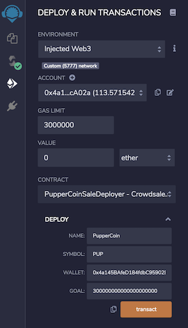
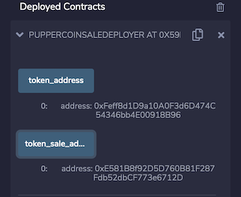
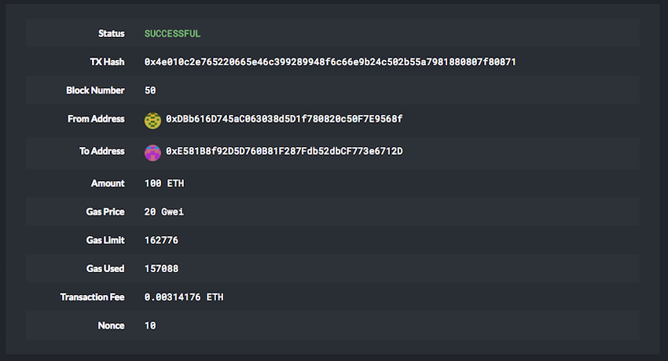
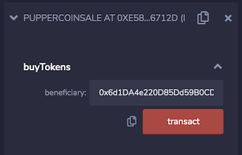
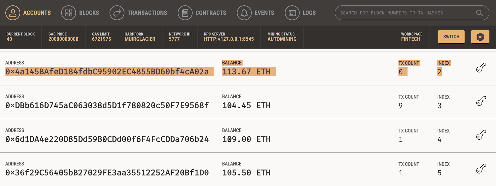
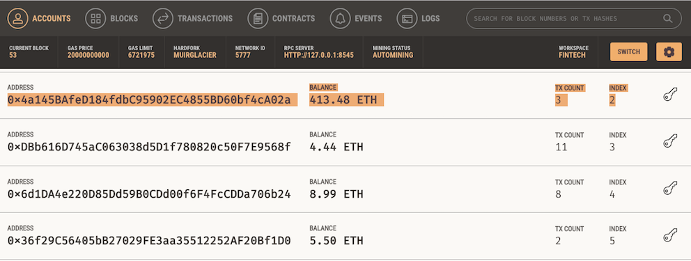
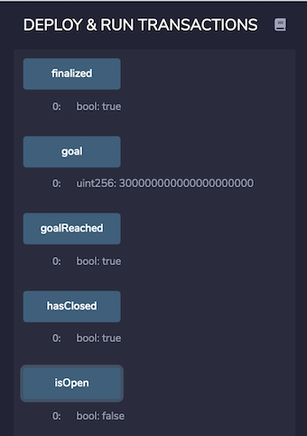
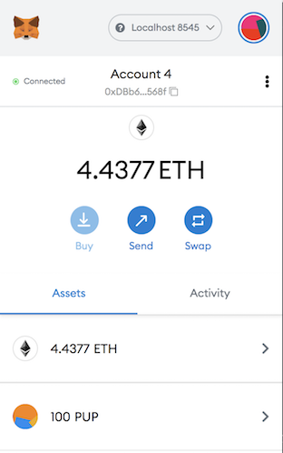
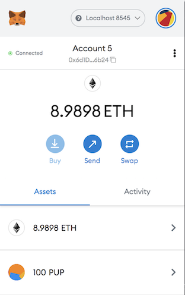
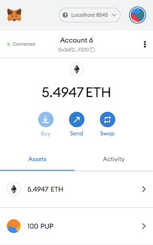

# Assignment_21_CrowdSale

## Overview

For this assignment, the objective was to build a Crowdsale for a company token called PupperCoin that would help fund network development. This network will be used to track the dog breeding activity across the globe in a decentralized way, and allow humans to track the genetic trail of their pets. The structure of the Crowdsale will allow for refunds, if the Crowdsale is successful and the goal is met. The maximum amount of Ether raised is capped at `300 Ether` and this is also the goal amount. The Crowdsale will run for 24 weeks; however, I have set it to 15mins for the sake of testing. The PupperCoin will be an ERC20 token and it will be minted through a Crowdsale contract that can be leveraged from the OpenZeppelin Solidity library. This Crowdsale contract will manage the entire process, allowing users to send ETH and get back PUP (PupperCoin). The contract will also mint the tokens automatically and distribute them to buyers in one transaction. It will need to inherit Crowdsale, CappedCrowdsale, TimedCrowdsale, RefundableCrowdsale, and MintedCrowdsale. Once finalized the crowdsale can be deployed on the Kovan or Ropsten testnet in order to get a real-world pre-production test in. For the sake of testing, and limitations with the amount of test `Ether` you can recieve on Kovan or Ropsten I have deployed the Crowdsale on my `Local 5777` Blockchain Network.

## CrowdSale Deployment

Navigate to the [Remix IDE](https://remix.ethereum.org) and create new solidity files for each contract. Below are links to the code for each smart contract.  

* [`PupperCoin.sol`](PupperCoin.sol) -- Smart Contract.

* [`Crowdsale.sol`](Crowdsale.sol) -- Smart Contract.

While developing and testing the contract, use the [Ganache](https://www.trufflesuite.com/ganache) development chain and point MetaMask to `localhost:8545`, or replace the port with what you have set in your workspace.

Once Metamask is connected, deploy the contracts on your local blockchain by going to the `Crowdsale.sol` file in remix and selecting `PupperCoinSaleDeployer - Crowdsale.sol` under the contract dropdown. 

Input the `wallet` that will recieve `Ether` in exchange for `PupperCoin`. Fill out the remaining fields as seen in the following screenshot:

* 

Once you hit transact, you should have a `Deployed Contract` as follows where you can see your `Crowdsale - Address` and `Token - Address`.  

* 

## Buying PupperCoin

There are two ways of buying PupperCoin during the Crowdsale. One way is to send `Ether` directly from your wallet to the `Crowdsale - Address`. In this case, I used MyCrypto Wallet. 

* 

And, the second is to connect your Metamask wallet in Remix and `Buy` tokens using the `Deployed Contract` dropdown, as shown below. Set the `beneficiary` to the address that will be sending the `Ether`.

* 

## Account Balances

In order to check, that your smart contract is working. We can look at the balances of the Accounts we used in Ganache. Below we can see that the account `selling` PupperCoin raised `300ETH` and the Accounts `buying` each spent `100ETH`.

Account3 (Seller):   113.44ETH ----> 413.44ETH
Account4 (Buyer):   104.44ETH ----> 4.44ETH
Account5 (Buyer):   108.99ETH ----> 8.99ETH
Account6 (Buyer):   105.49ETH ----> 5.49ETH

**Before:**

* 

**After:**
* 

## Finalizing The Crowdsale

Once we have completed the transactions and the `goal` of `300ETH` has been achieved we can click the `Finalize` button in order to finalize the Crowdsale. In order for this to work, the Crowdsale `closingTime` will need to be reached. In my case, I set it to `Now + 15 Minutes`. We can then check that the Crowdsale has been finalized by clicking the blue `finalized`, `goalReached` and `hasClosed` buttons.

* 

## MetaMask - PupperCoin

The last step is for our Buyers to withdraw there `PupperCoin` by inputting their address into the `withdrawTokens` box. The other option would be to refund the account with `Ether`. Once we have withdrawn our tokens, we can view them in our Metamask wallet by adding the `PupperCoin` token address. Below is the final balance of each account that bought `PupperCoin`.  

*   

